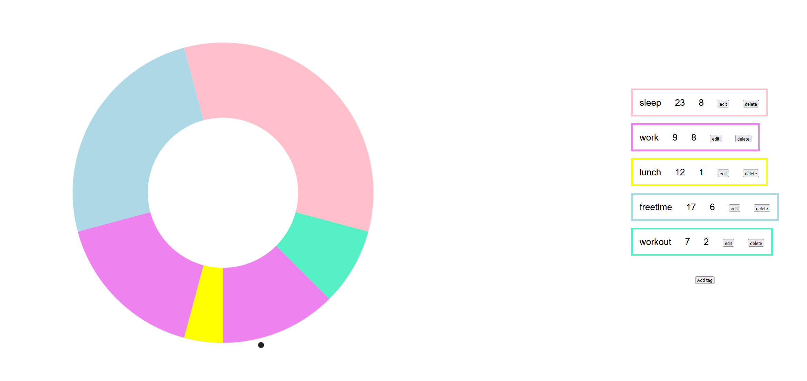

# Day Planner
Visually minimal app to plan your daily routine.

## Example

The little black dot around the circle, represents the current time needle.

Mapping clock position to specific times:

| Position | Time     |
|----------|----------|
| North    | Midnight |
| East     | 6am      |
| South    | 12pm     |
| West     | 18pm     |

## Usage
Customize your routine by using the UI or changing the `tag` variable in `sidebar.component.ts`
```ts
//start and duration are in hours
tags: Tag[] = [
    {name:'sleep',start:23,duration:8,color:'pink'},
    {name:'work',start:9,duration:8,color:'violet'},
    {name:'lunch',start:12,duration:1,color:'yellow'},
    {name:'freetime',start:17,duration:6,color:'#add8e6'},
    {name:'workout',start:7,duration:2,color:'#55efc4'}
];
```
