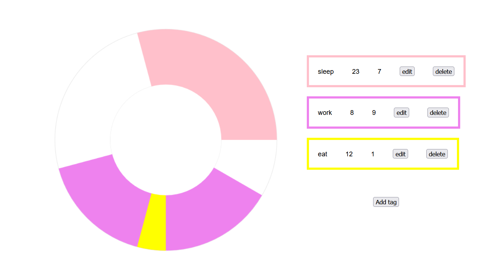

# Day Planner
Visually minimal app to plan your daily routine.

## Example



## Usage
Customize your routine by using the UI or changing the `tag` variable in `sidebar.component.ts`
```ts
//start and duration are in hours
tags: Tag[] = [
    {name:'sleep',start:22,duration:8,color:'#222'},
    {name:'work',start:12,duration:4,color:'#f00'}
];
```
